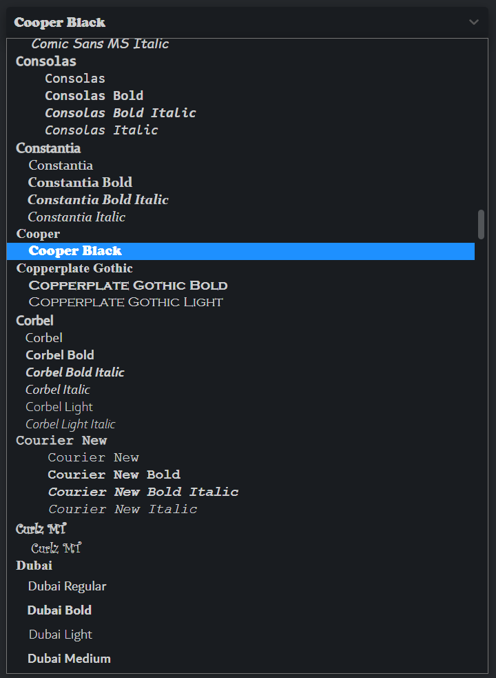

<h1 align="center">
	Simple Font Select
</h1>
<p align="center">
  <br>
</p>

An insanely simple font select component. Exposes all local fonts as CSS font families. All local font families are prefixed with `lfa-` to avoid conflicts with the browser's built fonts, for example: `lfa-Arial` or `lfa-Consolas`.

Requires the browser to support the [Local Font Access API](https://developer.mozilla.org/en-US/docs/Web/API/Local_Font_Access_API)

As this component is just a select element with custom options you can style it with your desired css framework.

## Functions:
```jsx
import FontSelect, { loadFonts } from 'simple-font-select'

let fontFamily

function fontChange (e) {
  // https://developer.mozilla.org/en-US/docs/Web/API/FontData
  const fontData = e.detail
  fontFamily = fontData.fullName
}

<FontSelect value='Arial' on:change={fontChange} class='w-500' />
<div style='font-family: lfa-{fontFamily}'>
  My text!
</div>
```
Note: the `value` prop isn't reactive, it's only there to set an inital value of the component.

Note: the first time this component is mounted it will cause the CSS stylesheets to recalculate which can be laggy, if you wish to avoid this you can preload the fonts before the component is ever mounted, this will only ever happen once:
```jsx
import { loadFonts } from 'simple-font-select'

function schedulePreload () {
  // https://developer.mozilla.org/en-US/docs/Web/API/Window/requestIdleCallback
  self.requestIdleCallback(loadFonts, { timeout: 15000 })
}

<!-- this is necessary as the site cannot query the LFA API without user input -->
<svelte:body on:click={schedulePreload}>
```

This module uses $$restProps, which means you can pass any property to the root element, like style, class etc.

Or use as a web component outside Svelte:
```html
<script src="https://cdn.jsdelivr.net/npm/simple-font-select@latest/dist/simple-font-select.js"></script>
<body>
  <simple-font-select class='w-300 form-control'></simple-font-select>
</body>
```